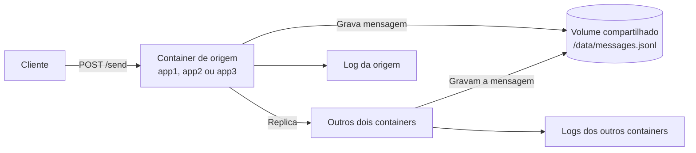

# Sistema distribuído de mensagens

Aplicação Flask executada em três containers Docker. As mensagens são gravadas em um volume compartilhado e replicadas entre as instâncias pela rede bridge do Docker Compose.

## Fluxo da aplicação



Ao receber um `POST /send`, o container que recebe a requisição grava a mensagem no volume compartilhado, replica o conteúdo para os outros dois containers e registra o evento em seu próprio log. Os containers que recebem a réplica também gravam seus eventos nos respectivos logs.

## Estrutura

```text
/avaliacao/
├── app/
│   ├── app.py
│   ├── requirements.txt
│   └── Dockerfile
├── docker-compose.yml
├── test.sh
└── README.md
```

## Como executar

Pré-requisitos: Docker com Docker Compose e, para executar `test.sh`, `curl` e Python 3.

```bash
docker compose up -d --build
```

Verifique o funcionamento:

```bash
curl http://localhost:5001/health
curl -X POST http://localhost:5001/send \
  -H "Content-Type: application/json" \
  -d '{"mensagem":"hello"}'
curl http://localhost:5002/messages
```

Execute o teste completo:

```bash
bash test.sh
```

Para acompanhar os logs:

```bash
docker compose logs -f
```

Para parar os containers sem remover os dados:

```bash
docker compose down
```

Para parar os containers e remover o volume persistente:

```bash
docker compose down -v
```

## Endpoints

- `GET /health`: verifica se a instância está disponível.
- `POST /send`: recebe `{"mensagem":"texto"}` e replica a mensagem.
- `GET /messages`: lista as mensagens persistidas.
- `POST /internal/replicate`: endpoint interno usado entre containers.

As portas externas são `5001`, `5002` e `5003`. Internamente, os serviços se comunicam usando os nomes `app1`, `app2` e `app3`.

O endpoint aceita tanto o campo descritivo `mensagem` quanto `message`, usado no exemplo do enunciado.
